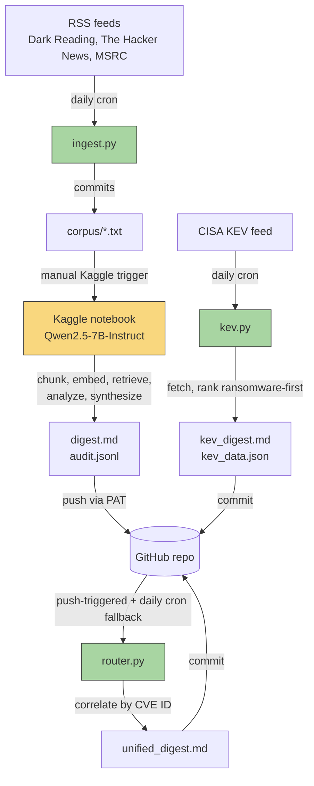

# Emerging Threat Detection Agent

A production-style threat intelligence pipeline that ingests security news
and CISA's confirmed-exploited vulnerability catalog, uses an LLM to extract
and rank grounded risk assessments, correlates the two, and produces
detection-engineering-actionable output: MITRE ATT&CK technique mapping,
required log sources, detection feasibility, and a concrete recommendation
(new use case / tune existing rule / watchlist / hunting query).

Every LLM call's prompt, raw output, and retrieved source text is logged to
an audit trail — nothing in the digests should be trusted without being
traceable back to real source material.

## Architecture

Two independent data lanes feed a router that correlates them by CVE ID:



**Green boxes run fully automated in GitHub Actions.** The Kaggle notebook
(yellow) is the one manual step in the pipeline — see
[Known limitations](#known-limitations).

## Automation schedule

```mermaid
gantt
    dateFormat HH:mm
    axisFormat %H:%M
    title Daily GitHub Actions schedule (UTC)
    section Ingestion
    RSS ingest (ingest.yml)      :06:00, 5m
    section KEV lane
    KEV fetch (kev_fetch.yml)    :07:00, 5m
    section Router
    Router fallback (router.yml) :08:00, 5m
```



`router.yml` also triggers immediately on any push to `digest.md`,
`audit.jsonl`, or `kev_data.json` — the daily 08:00 run is a fallback for
the one path that can't push-trigger it (see
[Known limitations](#known-limitations)).

## What's in this repo

| Path | Purpose |
|---|---|
| `src/threat_digest/ingest.py`, `feeds.py`, `seen.py` | RSS ingestion lane: fetch, dedupe, write to `corpus/` |
| `src/threat_digest/corpus.py`, `chunking.py`, `retrieval.py` | Load documents, chunk, embed + retrieve top-k risk-relevant passages |
| `src/threat_digest/llm_analysis.py` | Build the risk-scoring prompt, parse the LLM's grounded summary/rationale/score |
| `src/threat_digest/synthesis.py`, `attack_reference.py` | Second LLM call (risk_score ≥ 6 only): ATT&CK technique, log sources, feasibility, recommendation |
| `src/threat_digest/digest.py`, `audit.py`, `pipeline.py` | Rank items, render `digest.md`, write the full audit trail |
| `src/threat_digest/kev.py` | Structured KEV lane: fetch CISA's catalog, rank ransomware-linked first, render `kev_digest.md` + `kev_data.json` |
| `src/threat_digest/router.py` | Correlate RAG + KEV lanes by CVE ID, render `unified_digest.md` |
| `notebooks/run_build_b.ipynb` | Kaggle GPU notebook running the RAG lane's LLM steps |
| `.github/workflows/` | `ingest.yml`, `kev_fetch.yml`, `router.yml` (automation), `test.yml` (CI) |
| `docs/superpowers/specs/`, `docs/superpowers/plans/` | Design specs and implementation plans for every sub-project, in build order |

## Output files (repo root, always reflect the latest run)

- **`digest.md`** — RAG lane: ranked articles with risk scores, and (for
  high-risk items) ATT&CK/log sources/feasibility/recommendation
- **`kev_digest.md`** — KEV lane: 200 most-recent CISA-confirmed-exploited
  CVEs, ransomware-linked entries ranked first, with MITRE CWE
  classification and CISA's own reference links per entry
- **`unified_digest.md`** — Router: CVEs confirmed by *both* lanes ranked
  first, then RAG-only high-risk items, then a recency-ordered KEV-only
  sample
- **`audit.jsonl`** — every LLM prompt, raw output, retrieved source
  passages, and risk score — the ground-truth trail for verifying nothing
  in the digests was hallucinated
- **`kev_data.json`** — the KEV lane's structured (non-markdown) output,
  consumed by the router

## Running this yourself

**Prerequisites:** Python 3.11+, a GitHub repo (for the Actions workflows),
a Kaggle account with GPU quota (for the RAG lane's LLM step).

**Local setup:**
```bash
python -m venv .venv
.venv/Scripts/pip install -r requirements.txt
.venv/Scripts/pytest -v   # 72 tests, no network/GPU required
```

**Automated lanes** (already wired up as GitHub Actions — just need the repo
pushed to GitHub with Actions enabled):
- `ingest.yml` and `kev_fetch.yml` need no secrets — they only read public
  feeds and push with the default `GITHUB_TOKEN`.
- `router.yml` needs no secrets either.

**RAG lane (manual, GPU-based):**
1. Open `notebooks/run_build_b.ipynb` on Kaggle, confirm the accelerator is
   set to **T4** under Settings (API-triggered runs have never reliably
   preserved this — always confirm in the browser UI before running).
2. Create a GitHub fine-grained Personal Access Token scoped only to this
   repo with **Contents: Read and write**, and add it as a Kaggle secret
   named `GITHUB_TOKEN` (Add-ons → Secrets) so the notebook's last cell can
   push `digest.md`/`audit.jsonl` back automatically.
3. **Save & Run All** from the browser UI (not the API — see
   [Known limitations](#known-limitations)).

## Known limitations

- **The RAG lane's LLM analysis step is not scheduled.** RSS ingestion and
  the KEV lane run fully unattended on daily crons; the Kaggle notebook
  that does the actual risk-scoring/synthesis LLM work still requires a
  human to manually trigger it via Kaggle's browser UI. API-triggered runs
  have never once reliably preserved the T4 GPU accelerator selection in
  this project — only a browser-triggered "Save & Run All" does. This is
  the single biggest gap between "automated pipeline" and "fully unattended
  production system."
- **KEV-only entries have no detection-engineering synthesis.** The KEV
  lane is deliberately LLM-free (CISA's own confirmed-exploited status
  already is the risk signal); ATT&CK/log-source/feasibility fields only
  exist for RAG-lane items that clear the risk threshold. Extending
  synthesis to KEV entries is a deferred, separately-scoped idea.
- **No notifications.** All three digests are files in the repo — nothing
  pushes a Slack/webhook alert when a new high-risk or dual-confirmed item
  appears. Someone has to go look.
- **No NVD/EPSS enrichment.** KEV membership alone is used as the
  structured-lane risk signal; CVSS scores and exploitation-probability
  data are out of scope for now.

## Design history

Every sub-project (Build B core RAG validation, live RSS ingestion,
detection-engineering synthesis, the structured KEV lane, the router) has
its own design spec and implementation plan under `docs/superpowers/`,
written and reviewed before implementation, in the order they were built.
Start with `docs/superpowers/specs/2026-07-17-threat-intel-rag-digest-design.md`
for the original project vision and roadmap.
